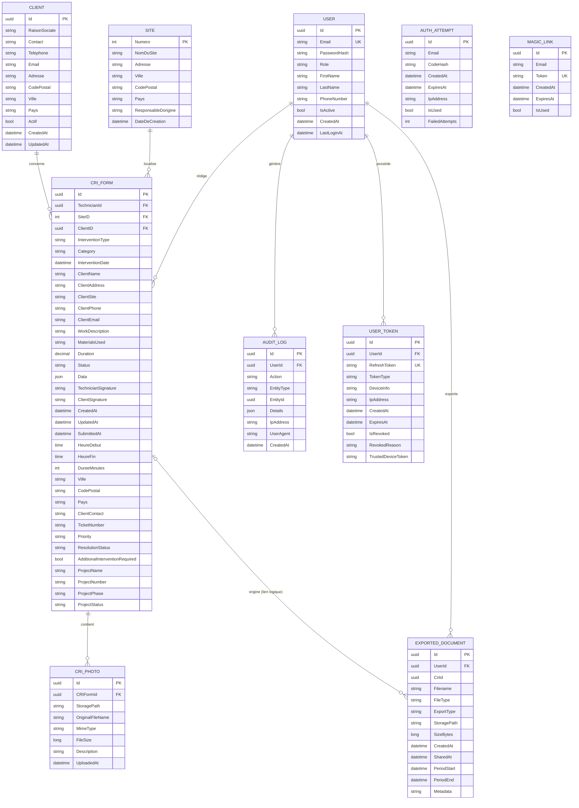

# Base de données — MCD & MLD

Modélisation de la base PostgreSQL de l'application Novadis CRI 2.0, dérivée des entités EF Core (`backend/src/NovadisApi/Data/NovadisDbContext.cs` et `backend/src/NovadisApi/Models/*`).

---

## 1. MCD — Modèle Conceptuel de Données

### Diagramme Mermaid (ER)



### Cardinalités (Merise)

| Association | Cardinalités | Notes |
|---|---|---|
| USER — rédige — CRI_FORM | (1,1) ── (0,n) | Technicien obligatoire (`RESTRICT`) |
| CRI_FORM — contient — CRI_PHOTO | (1,1) ── (0,n) | `CASCADE` |
| CLIENT — concerne — CRI_FORM | (0,1) ── (0,n) | FK nullable (`SET NULL`) — Phase 2 |
| SITE — localise — CRI_FORM | (0,1) ── (0,n) | FK nullable (`SET NULL`) — Phase 2 |
| USER — génère — AUDIT_LOG | (0,1) ── (0,n) | UserId nullable (`SET NULL`) |
| USER — possède — USER_TOKEN | (1,1) ── (0,n) | `CASCADE` |
| USER — exporte — EXPORTED_DOCUMENT | (1,1) ── (0,n) | `CASCADE` |
| CRI_FORM — origine — EXPORTED_DOCUMENT | (0,1) ── (0,n) | Lien logique (`CriId`), pas de FK formelle |

> `AUTH_ATTEMPT` et `MAGIC_LINK` sont rattachés à un **email** et non à un `UserId` (flux d'auth pré-identification durable).

---

## 2. MLD — Modèle Logique de Données

Notation relationnelle. `__PK__` clé primaire, `[U]` index unique, `*FK*` → table cible.

```text
Users(__Id__: uuid, Email[U], PasswordHash, Role, FirstName,
      LastName, PhoneNumber, IsActive, CreatedAt, LastLoginAt)

Sites(__Numero__: int, NomDuSite, Adresse, Ville, CodePostal,
      Pays, ResponsableDorigine, DateDeCreation)

ClientsNormalises(__Id__: uuid, RaisonSociale, Contact, Telephone,
      Email, Adresse, CodePostal, Ville, Pays, Actif,
      CreatedAt, UpdatedAt)

CRIForms(__Id__: uuid,
      *TechnicianId* → Users.Id            [NOT NULL, ON DELETE RESTRICT],
      *SiteID*       → Sites.Numero        [NULL,     ON DELETE SET NULL],
      *ClientID*     → ClientsNormalises.Id [NULL,    ON DELETE SET NULL],
      InterventionType, Category, InterventionDate,
      ClientName, ClientAddress, ClientSite, ClientPhone, ClientEmail,
      WorkDescription, MaterialsUsed, Duration(18,2), Status,
      Data(jsonb), TechnicianSignature, ClientSignature,
      CreatedAt, UpdatedAt, SubmittedAt,
      HeureDebut, HeureFin, DureeMinutes,
      Ville, CodePostal, Pays, ClientContact,
      TicketNumber, Priority, ResolutionStatus, AdditionalInterventionRequired,
      ProjectName, ProjectNumber, ProjectPhase, ProjectStatus)

CRIPhotos(__Id__: uuid,
      *CRIFormId* → CRIForms.Id [NOT NULL, ON DELETE CASCADE],
      StoragePath, OriginalFileName, MimeType, FileSize,
      Description, UploadedAt)

AuditLogs(__Id__: uuid,
      *UserId* → Users.Id [NULL, ON DELETE SET NULL],
      Action, EntityType, EntityId, Details, IpAddress,
      UserAgent, CreatedAt)

AuthAttempts(__Id__: uuid, Email, CodeHash, CreatedAt, ExpiresAt,
      IpAddress, IsUsed, FailedAttempts [, PlainCode (DEBUG only)])

UserTokens(__Id__: uuid,
      *UserId* → Users.Id [NOT NULL, ON DELETE CASCADE],
      RefreshToken[U], TokenType, DeviceInfo, IpAddress,
      CreatedAt, ExpiresAt, IsRevoked, RevokedReason,
      TrustedDeviceToken)

MagicLinks(__Id__: uuid, Email, Token[U], CreatedAt, ExpiresAt, IsUsed)

ExportedDocuments(__Id__: uuid,
      *UserId* → Users.Id [NOT NULL, ON DELETE CASCADE],
      CriId   → CRIForms.Id (lien logique, pas de FK formelle déclarée),
      Filename, FileType, ExportType, StoragePath, SizeBytes,
      CreatedAt, SharedAt, PeriodStart, PeriodEnd, Metadata)
```

### Index

| Table | Index | Type |
|---|---|---|
| Users | Email | UNIQUE |
| Sites | NomDuSite, Ville, CodePostal | non-unique |
| ClientsNormalises | RaisonSociale, Ville | non-unique |
| CRIForms | TechnicianId, CreatedAt, InterventionDate, Status, Priority, ResolutionStatus, Ville, ProjectStatus, TicketNumber, ProjectNumber, SiteID, ClientID | non-unique |
| CRIPhotos | CRIFormId | non-unique |
| AuditLogs | UserId, CreatedAt | non-unique |
| AuthAttempts | Email, (Email, CreatedAt) | non-unique |
| UserTokens | RefreshToken (U), UserId | mixte |
| MagicLinks | Token (U), Email | mixte |
| ExportedDocuments | UserId, CriId, CreatedAt | non-unique |

---

## 3. Notes d'implémentation

- **SGBD** : PostgreSQL (migré depuis SQL Server). Les types `Guid` C# → `uuid` PG ; `string` → `varchar`/`text` ; `DateTime` → `timestamp` ; `TimeSpan` → `interval` ; `bool` → `boolean`.
- **Phase 1** : colonnes statistiques extraites du JSON `Data` directement dans `CRIForms` (`Ville`, `CodePostal`, `Priority`, `ProjectStatus`, etc.) pour requêtes indexées.
- **Phase 2** : normalisation des relations `CRIForms.SiteID` → `Sites` et `CRIForms.ClientID` → `ClientsNormalises` (FK nullables, déduplication progressive).
- **Auth** : `AuthAttempts` (OTP) et `MagicLinks` ne sont pas reliés par FK à `Users` — ils opèrent sur l'`Email` avant identification.
- **`ExportedDocuments.CriId`** : champ déclaré mais pas configuré comme FK dans `OnModelCreating` — relation logique uniquement.
